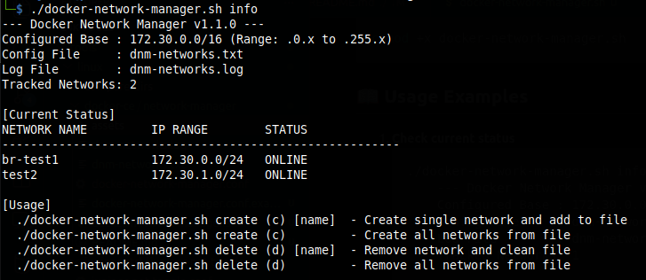
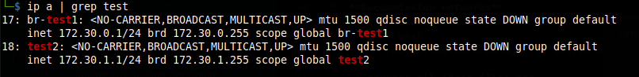

# 🐳 Docker Network Manager

A lightweight, production-ready Bash utility to manage external Docker bridge networks with automatic IPAM (IP Address Management). It ensures your network configurations are persistent, documented, and free from subnet overlaps.

---

## 🚀 Key Features
* **Smart Subnet Allocation:** Automatically finds the next available /24 block within your specified range (e.g., `172.30.x.x`).
* **Infrastructure as Code (Lite):** Keep your network names in a simple text file; the script handles the rest.
* **Safe Operations:**
    * Interactive confirmation for bulk deletions.
    * ShellCheck-validated code (Strict Mode: `set -euo pipefail`).
    * Non-interactive mode support (via `FORCE=true`).
* **Status Dashboard:** Instant overview of which tracked networks are `ONLINE` or `OFFLINE`.

## 🛠 Installation & Setup
1. **Clone the repo** (or add the code to your admin toolbox).
2. Create the config file:
```bash
cp docker-network-manager.conf.example docker-network-manager.conf
#OR
cat <<EOF > docker-network-manager.conf
NET_FILE="./dnm-networks.txt"
LOG_FILE="./dnm-networks.log"
BASE_NET="172.30"
START_OCTET=0
END_OCTET=255
EOF
```
3. **Make script executable:**
```bash
chmod +x docker-network-manager.sh
```

## 📖 Usage Examples
1. **Check current status**
    ```bash
    ./docker-network-manager.sh info
    ```
    Example:\
    
2. **Provision networks**
    * **From file:** Add network names to dnm-networks.txt and run:
        ```bash
        ./docker-network-manager.sh create
        ```
    * **Single network:**
        ```bash
        ./docker-network-manager.sh create br-project-alpha
        ```
3. **Decommission networks**
    * **Remove and cleanup:**
        ```bash
        ./docker-network-manager.sh delete br-project-alpha
        ```
    * **Purge all (from file):***
        ```bash
        ./docker-network-manager.sh delete
        ```

### ⚠️ IMPORTANT
> **Interface Name Limit**: Linux has a **15-character** limit for network interface names. Ensure your Docker network names stay within this limit to maintain consistent bridge naming.

## 🧩 Native OS Integration
Unlike standard Docker networks that create cryptic interface names (e.g., br-837d9f...), this manager assigns the actual network name to the Linux bridge interface.

This allows you to:
* Monitor traffic per-network using standard tools (tcpdump -i br-test1).
* Create persistent firewall rules (IPTables/NFTables) targeting specific bridges.
* Easily identify networks in ip addr or ifconfig output.\
Example:\


## 📊 Summary Table of Commands
| Command | Short | Argument | Description |
| :--- | :--- | :--- | :--- |
| `create` | `c` | [name] | Provisions network(s) and updates config file. |
| `delete` | `d` | [name] |	Removes network(s) from Docker and config file. |
| `info` | `i`	| - | Displays dashboard with IP ranges and statuses. |

## ⚙️ Configuration Variables
| Variable | Default | Description |
| :--- | :--- | :--- |
| `BASE_NET` |	`172.30` | The first two octets of your managed pool. |
| `START_OCTET` |	`0` | Starting range for the 3rd octet. |
| `END_OCTET` |	`255` | Ending range for the 3rd octet. |
| `NET_FILE` |	`./dnm-networks.txt` | File where network names are stored. |
---

### ⚖️ License
MIT [LICENSE](https://github.com/andsyrovatko/s4k-admin-toolbox/blob/main/LICENSE). Free to use and modify.
